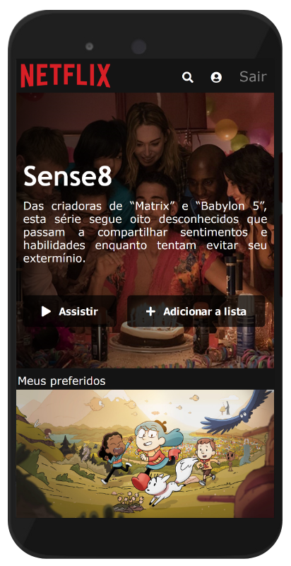

# netflix-homepage
Projeto de replicar uma página semelhante a página principal da Netflix. A base do código foi criada durante aula do professor Felipe Aguiar da DIO. Eu mudei algumas coisas para ficar ainda mais próximo do design da Netflix atual e coloquei um pouco de interação com a primeira linha de filmes e séries, onde passar o mouse ou clicar em algum deles a tela principal muda.

Para testar a versão ao vivo, [clique aqui.](https://cursos-e-estudos.github.io/netflix-homepage/)
 

<b> Visual desktop </b>

  

 

---

 

<b> Visual mobile </b>

  

